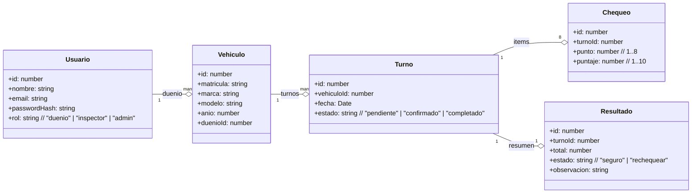

# Torque - Trabajo Práctico Integrador

Alumno: Gonzalo Manuel Prada
Legajo: 0136007

## Descripción del proyecto 

Torque es una API backend desarrollada para gestionar el control anual del estado de vehículos.
El objetivo es permitir que los usuarios dueños soliciten un turno de revisión, un inspector evalúe el estado del vehículo mediante 8 puntos de chequeo puntuados del 1 al 10, y finalmente el sistema determine si el vehículo es seguro o debe rechequear.

Este proyecto sigue un modelo cliente-servidor, con backend desacoplado, orientación a objetos, uso de inyección de dependencias (DI) en el módulo de vehículos y capa de negocio bien separada.

## Stack 

- Node.js + Express – servidor web / API REST
- Sequelize – ORM para PostgreSQL
- PostgreSQL – base de datos relacional
- JWT + bcrypt – autenticación y seguridad
- Awilix – inyección de dependencias
- Docker + Docker Compose – entorno de ejecución
- Postman – pruebas manuales

```
src/
 ├── controllers/
 ├── routes/
 ├── models/
 ├── middleware/
 ├── db/
 ├── di/
 └── utils/
init.sql
docker-compose.yml
app.js
server.js

```
#### Capas principales 

- Routes: Define los endpoints 
- Controllers: Contiene la lógica de cada caso de uso 
- Models: Tablas mapeadas con Sequelize 
- Middleware: Funciones reutilizables de auth, roles, ownership
- DI (Awilix): Aplicado a Vehiculos 
- DB: Conexión + script SQL Inicial 

## Requerimientos 

El sistema cumple con: 

1. Dueño solicita turno registrando su auto junto con su matrícula
2. El sistema muestra disponibilidad de turnos 
3. El dueño confirma su turno
4. Un inspector evalúa 8 puntos
5. Reglas automáticas: 
    - Total >= 80 (y ningun < 5) → seguro 
    - Total < 40 → rechequear
    - Algún puntaje <5 → rechequear
6. Inspector puede agregar observaciones en caso de rechequeo
7. Dueño ve el resultado

Control de roles: 
- Dueño: Puede operar solo sobre sus vehículos/turnos/resultados 
- Inspector: Realiza chequeos y observaciones

## UML 



## Endpoints 

### Autenticación

| Método | Endpoint                 | Descripción                       | Auth |
|--------|---------------------------|-----------------------------------|------|
| POST   | /api/usuarios/registrar  | Registrar usuario nuevo           | ❌   |
| POST   | /api/usuarios/login      | Login y obtener JWT               | ❌   |

### Vehiculos 

| Método | Endpoint                          | Descripción                                | Auth                |
|--------|------------------------------------|--------------------------------------------|---------------------|
| GET    | /api/vehiculos                     | Listar vehículos del usuario               | ✅ dueño/admin      |
| POST   | /api/vehiculos                     | Registrar vehículo                         | ✅ dueño/admin      |
| GET    | /api/vehiculos/:vehiculo_id        | Obtener vehículo por ID                    | ✅ dueño/admin      |
| PUT    | /api/vehiculos/:vehiculo_id        | Actualizar vehículo                        | ✅ dueño/admin      |
| DELETE | /api/vehiculos/:vehiculo_id        | Eliminar vehículo                          | ✅ dueño/admin      |

### Turnos 

| Método | Endpoint                                            | Descripción                                           | Auth        |
|--------|------------------------------------------------------|-------------------------------------------------------|-------------|
| GET    | /api/turnos/disponibilidad?fecha=2025-11-15        | Obtener disponibilidad por matrícula                  | ✅ dueño    |
| POST   | /api/turnos/solicitar                               | Solicitar turno ingresando matrícula y fecha          | ✅ dueño    |
| POST   | /api/turnos/confirmar                               | Confirmar turno solicitado                            | ✅ dueño    |
| GET    | /api/turnos/:turno_id                               | Obtener datos del turno                               | ✅ dueño    |

### Chequeos 

| Método | Endpoint                                         | Descripción                                      | Auth               |
|--------|---------------------------------------------------|--------------------------------------------------|--------------------|
| POST   | /api/chequeos                                     | Crear o actualizar un ítem (1..8) del turno     | ✅ inspector/admin |
| GET    | /api/chequeos/:turno_id                           | Listar los ítems cargados de un turno           | ✅ inspector/admin |
| DELETE | /api/chequeos/turno/:turno_id/punto/:punto        | Eliminar un ítem y reabrir el turno si aplica   | ✅ inspector/admin |

### Resultados

| Método | Endpoint                                            | Descripción                                   | Auth               |
|--------|------------------------------------------------------|-----------------------------------------------|--------------------|
| GET    | /api/resultados/turno/:turno_id                     | Obtener resultado final del turno             | ✅ dueño/inspector |
| PUT    | /api/resultados/turno/:turno_id/observacion         | Cargar observación del inspector              | ✅ inspector/admin |
| POST   | /api/resultados/recalcular/:turno_id               | Recalcular resultado según chequeos actuales  | ✅ inspector/admin |


## Cómo ejecutar el proyecto 

La ejecución es simple, simplemente requiere docker y docker compose instalados. Ejecutar el comando: 

```bash
docker compose up -d --build
```

La api queda en http://localhost:3000

## Testing 

Este TP realiza tests mediante POSTMAN, dentro de la carpeta docs, se adjuntan las coleccciones para importar y testear, con los endpoints ya cargados. 