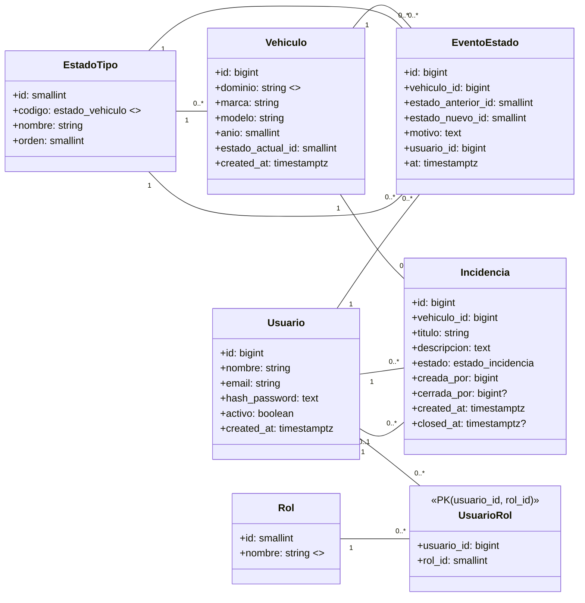

# Torque
App de gestión de vehículos, incidencias y control de flota.

```mermaid
classDiagram
  direction LR

  class Usuario {
    +id: bigint
    +nombre: string
    +email: string
    +hash_password: text
    +activo: boolean
    +created_at: timestamptz
  }

  class Rol {
    +id: smallint
    +nombre: string  <<UNIQUE>>
  }

  class UsuarioRol {
    +usuario_id: bigint
    +rol_id: smallint
    <<PK(usuario_id, rol_id)>>
  }

  class EstadoTipo {
    +id: smallint
    +codigo: estado_vehiculo  <<UNIQUE>>
    +nombre: string
    +orden: smallint
  }

  class Vehiculo {
    +id: bigint
    +dominio: string <<UNIQUE>>
    +marca: string
    +modelo: string
    +anio: smallint
    +estado_actual_id: smallint
    +created_at: timestamptz
  }

  class EventoEstado {
    +id: bigint
    +vehiculo_id: bigint
    +estado_anterior_id: smallint
    +estado_nuevo_id: smallint
    +motivo: text
    +usuario_id: bigint
    +at: timestamptz
  }

  class Incidencia {
    +id: bigint
    +vehiculo_id: bigint
    +titulo: string
    +descripcion: text
    +estado: estado_incidencia
    +creada_por: bigint
    +cerrada_por: bigint?
    +created_at: timestamptz
    +closed_at: timestamptz?
  }

  %% Relaciones
  Usuario "1" -- "0..*" UsuarioRol 
  Rol "1" -- "0..*" UsuarioRol 

  EstadoTipo "1" -- "0..*" Vehiculo 
  Vehiculo "1" -- "0..*" EventoEstado 
  EstadoTipo "1" -- "0..*" EventoEstado 
  EstadoTipo "1" -- "0..*" EventoEstado 
  Usuario "1" -- "0..*" EventoEstado 

  Vehiculo "1" -- "0..*" Incidencia 
  Usuario "1" -- "0..*" Incidencia 
  Usuario "0..1" -- "0..*" Incidencia 

```
