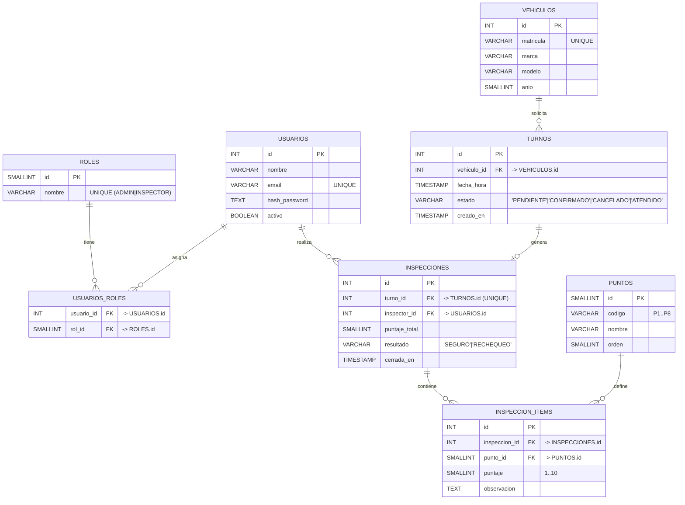

# Torque - Trabajo Práctico Integrador

Alumno: Gonzalo Manuel Prada
Legajo: 0136007

## UML 

## FLUJO 

1–4. Turnos: el dueño ingresa matrícula, ve disponibilidad y confirma (TURNOS con estados).
5–6. Inspección: un INSPECTOR carga 8 ítems (INSPECCION_ITEMS) con puntaje 1–10 sobre PUNTOS fijos.
7–8. Reglas: al cerrar la inspección se calcula el puntaje_total y resultado:

>= 80 → SEGURO

< 40 o algún ítem < 5 → RECHEQUEO

(40–79 sin ítems <5) → podés dejar como RECHEQUEO también para simplificar y cumplir consigna

## Endpoints

### Login

| Verbo | Endpoint      | Descripción | Auth |
| ----- | ------------- | ----------- | ---- |
| POST  | `/auth/login` | Login y JWT | —    |

### Vehiculo

| Verbo | Endpoint                | Descripción                      | Auth            |
| ----- | ----------------------- | -------------------------------- | --------------- |
| GET   | `/vehiculos?matricula=` | Obtener por matrícula (opcional) | ADMIN/INSPECTOR |
| POST  | `/vehiculos`            | Alta (si no existe)              | ADMIN           |
| GET   | `/vehiculos/:id`        | Detalle                          | ADMIN/INSPECTOR |
| PUT   | `/vehiculos/:id`        | Actualizar                       | ADMIN           |

### Puntos

| Verbo | Endpoint  | Descripción              | Auth |
| ----- | --------- | ------------------------ | ---- |
| GET   | `/puntos` | Lista de 8 puntos (seed) | —    |

### Turnos

| Verbo | Endpoint                            | Descripción                                              | Auth |
| ----- | ----------------------------------- | -------------------------------------------------------- | ---- |
| GET   | `/turnos/disponibilidad`            | Slots disponibles (ej: próximos días/horarios estándar)  | —    |
| POST  | `/turnos/solicitar`                 | Crea turno **PENDIENTE** `{matricula, fecha_hora}`       | —    |
| POST  | `/turnos/:id/confirmar`             | Pasa **PENDIENTE → CONFIRMADO** (confirmación del dueño) | —    |
| GET   | `/turnos/:id`                       | Ver estado del turno                                     | —    |
| POST  | `/turnos/:id/cancelar` *(opcional)* | Cancela si todavía no fue atendido                       | —    |

### Inspecciones 

| Verbo | Endpoint                           | Descripción                                                                                 | Auth      |
| ----- | ---------------------------------- | ------------------------------------------------------------------------------------------- | --------- |
| POST  | `/inspecciones`                    | Crear inspección para **turno CONFIRMADO** `{turno_id}` (marca turno “ATENDIDO” al cerrar)  | INSPECTOR |
| GET   | `/inspecciones/:id`                | Ver inspección                                                                              | INSPECTOR |
| PUT   | `/inspecciones/:id/items/:puntoId` | Cargar/actualizar puntaje `1..10` y `observacion` de un ítem                                | INSPECTOR |
| POST  | `/inspecciones/:id/cerrar`         | Calcula total y **resultado** según regla; setea `puntaje_total`, `resultado`, `cerrada_en` | INSPECTOR |
