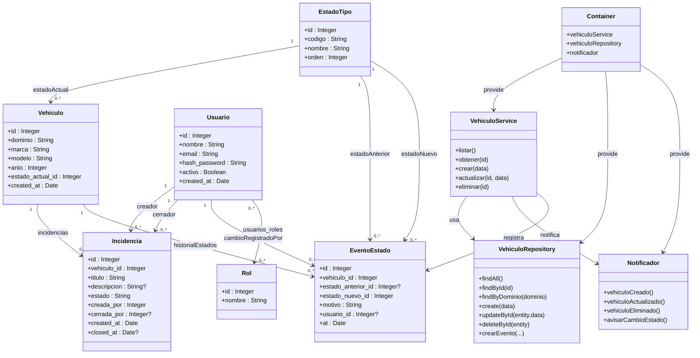

# Torque - Trabajo Práctico Integrador

Alumno: Gonzalo Manuel Prada
Legajo: 0136007

## Descripcion y alcance

Torque es un sistema backend para la gestión del estado de vehículos dentro de una flota. Permite administrar usuarios, roles, vehículos, tipos de estado, incidencias y un registro histórico automático de cambios de estado.

El sistema incluye: 
- API RESTfull en Node.js + Express. 
- Persistencia con PostgreSQL y manejado con Sequelize. 
- Autenticación JWT con roles. 
- Inyección de dependencias en Vehiculos. 

El objetivo de este sistema es proveer un backend que permita registrar, consultar, y administrar el estado de los vehiculos en una flota, junto al historial e incidencias asociadas. 

## Justificación de Arquitectura 

- Express: Framework simple y bien documentado. 
- Sequelize: Permite modelos tipados, validaciones y relaciones. 
- PostgreSQL: Motor estable y bien documentado, gran combinación con Sequelize. 
- Awilix: Permite independizar lógica de infraestructura. 

## Estructura del proyecto

```
Torque-backend/
├─ server.js               # Punto de entrada - inicia Express
├─ app.js                  # Middlewares generales y rutas
└─ src/
   ├─ db/
   │  ├─ conexion.js       # Configuración de Sequelize
   │  └─ init.sql          # Seed + schema de DB
   ├─ models/              # Modelos Sequelize
   ├─ controllers/         # Lógica de endpoints
   ├─ routes/              # Routers por recurso
   ├─ middleware/          # JWT + roles
   └─ di/                  # Inyección de Dependencias (Awilix)
       ├─ container.js
       ├─ vehiculoRepository.js
       ├─ vehiculoService.js
       └─ notificador.js

```

## Endpoints

## Autenticación
| Método | Endpoint              | Descripción            |
|--------|------------------------|--------------------------|
| POST   | /api/v1/auth/login     | Inicia sesión y devuelve JWT |

## Usuarios
| Método | Endpoint                | Descripción                  |
|--------|--------------------------|------------------------------|
| GET    | /api/v1/usuarios         | Listar usuarios              |
| POST   | /api/v1/usuarios         | Crear usuario                |
| GET    | /api/v1/usuarios/:id     | Obtener usuario por ID       |
| PUT    | /api/v1/usuarios/:id     | Actualizar usuario           |
| DELETE | /api/v1/usuarios/:id     | Eliminar usuario             |

## Vehículos  
| Método | Endpoint                  | Descripción                         |
|--------|----------------------------|-------------------------------------|
| GET    | /api/v1/vehiculos         | Listar vehículos                    |
| POST   | /api/v1/vehiculos         | Crear vehículo                      |
| GET    | /api/v1/vehiculos/:id     | Obtener vehículo por ID             |
| PUT    | /api/v1/vehiculos/:id     | Actualizar vehículo (registra evento de estado si cambia estado_actual_id) |
| DELETE | /api/v1/vehiculos/:id     | Eliminar vehículo                   |

## Estados de Vehículo (EstadoTipo)
| Método | Endpoint                | Descripción                      |
|--------|--------------------------|----------------------------------|
| GET    | /api/v1/estados         | Listar estados                   |
| POST   | /api/v1/estados         | Crear estado                     |
| GET    | /api/v1/estados/:id     | Obtener estado por ID            |
| PUT    | /api/v1/estados/:id     | Actualizar estado                |
| DELETE | /api/v1/estados/:id     | Eliminar estado                  |

## Incidencias
| Método | Endpoint                  | Descripción                  |
|--------|----------------------------|------------------------------|
| GET    | /api/v1/incidencias       | Listar incidencias           |
| POST   | /api/v1/incidencias       | Crear incidencia             |
| GET    | /api/v1/incidencias/:id   | Obtener incidencia por ID    |
| PUT    | /api/v1/incidencias/:id   | Actualizar incidencia        |
| DELETE | /api/v1/incidencias/:id   | Eliminar incidencia          |

## Guía de Ejecución

La ejecución requiere unicamente de docker + docker compose. 

En la raíz del proyecto, ejecutar el comando: 

```bash 
docker compose up -d
```
Esto levanta un PostreSQL con volumen persistente, inyecta un init.sql con datos a modo de prueba y expone la API de Node.js. 

| Servicio | URL                                                          | Descripción    |
| -------- | ------------------------------------------------------------ | -------------- |
| Backend  | [http://localhost:3000](http://localhost:3000)               | API Express    |
| API base | [http://localhost:3000/api/v1](http://localhost:3000/api/v1) | Endpoints REST |


## UML 


